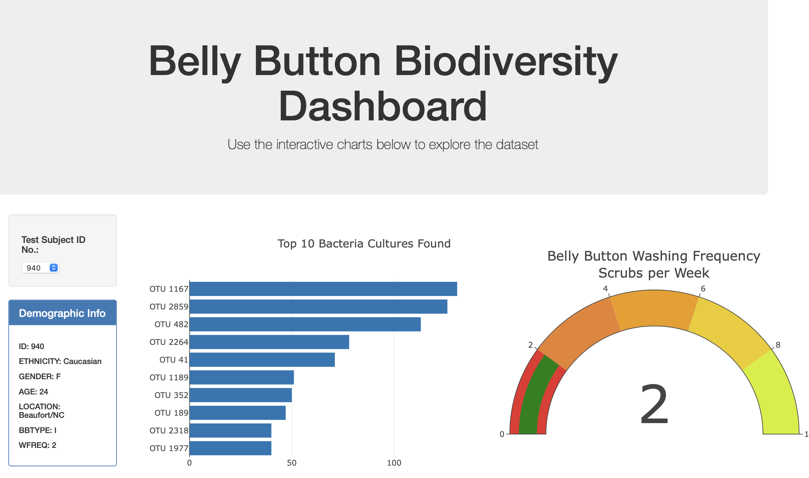
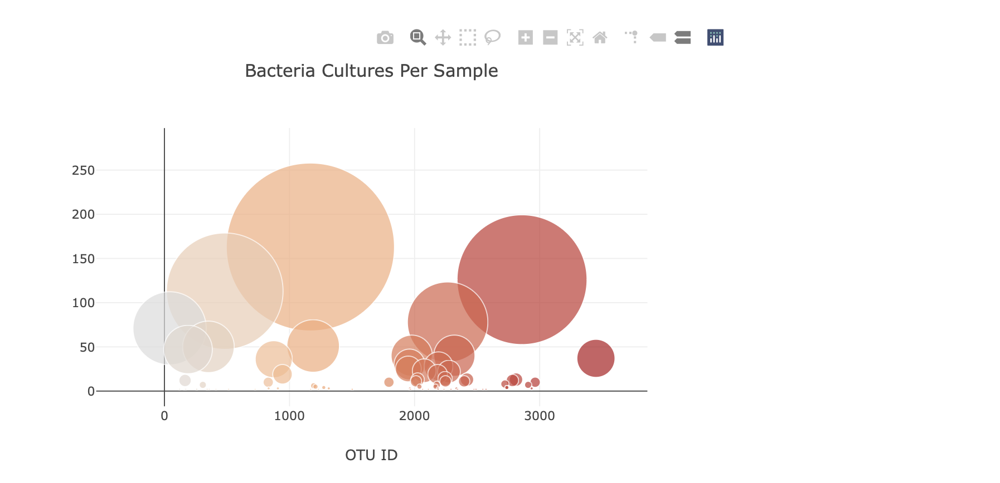

# belly-button-challenge
## Overview of Project

### Instructions

* Bar Chart (30 points)
    * Chart initializes without error (10 points)
    * Chart updates when a new sample is selected (5 points)
    * Chart uses Top 10 sample values as values (5 points)
    * Chart uses otu_ids as the labels (5 points)
    * Chart uses otu_labels as the tooltip (5 points)
* Bubble Charts (40 points)
    * Chart initializes without error (10 points)
    * Chart updates when a new sample is selected (5 points)
    * Chart uses otu_ids for the x values (5 points)
    * Chart uses otu_ids for marker colors (5 points)
    * Chart uses sample_values for the y values (5 points)
    * Chart uses sample_values for the marker size (5 points)
    * Chart uses `otu_labels for text values (5 points)
* Metadata and Deployment (30 points)
    * Metadata initializes without error (10 points)
    * Metadata updates when a new sample is selected (10 points)
    * App Successfully Deployed to Github Pages (10 points)

### Purpose

I am utilizing javascript and html to analyze data from a dataset in order to get more detailed information about what the data shows.

## Analysis and Challenges

### Analysis of Outcomes Based on Goals

* During this assignment I was able to complete all the goals and objectives for the assignment. I used what I have learned in the class to trouble shoot the code as I went through with javascript and made sure I was fully understanding what each part of my code did through labeling, so when an error popped up I knew how to approach the problem.

### Challenges and Difficulties Encountered

* I think the biggest challenge for me was figuring out how to utilize the new language, javascript, to create the html page showing the graphs.

### HTML page

